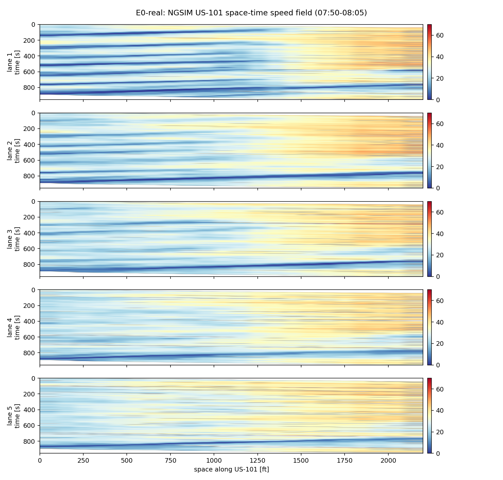
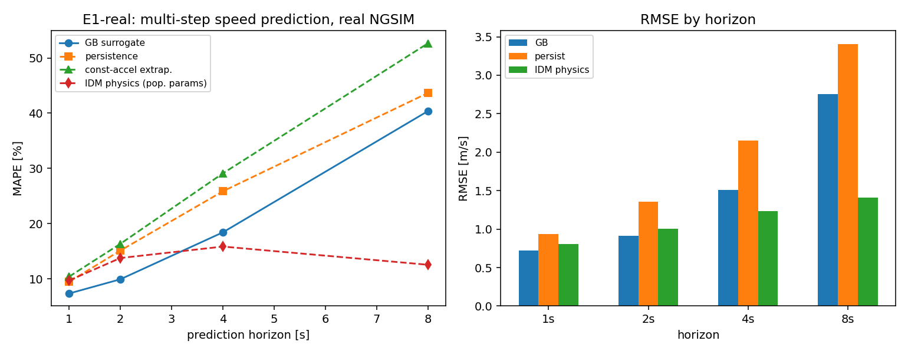
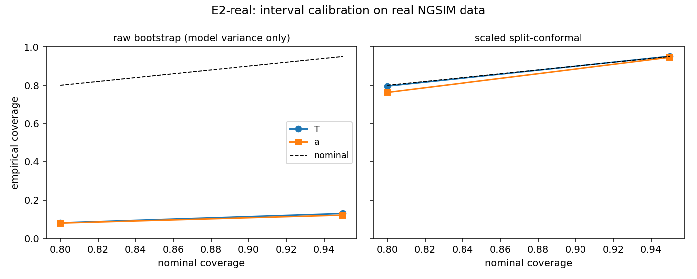
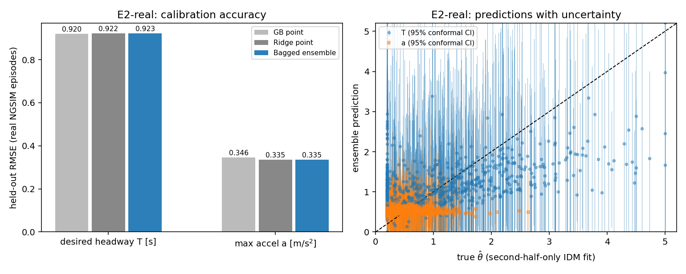
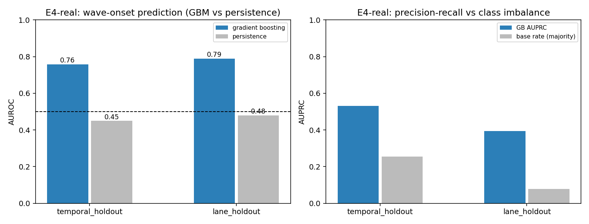

# Real-Data Experiment Report — SafeTwin / FROST-Twin Preliminary Evidence

**Status (2026-08-23).** All results in this report are on **real freeway trajectory data** — the FHWA NGSIM US-101 dataset (Los Angeles, 7:50–8:05 AM peak, 10 Hz, ~1.17 M rows, 2,139 vehicles after cleaning), obtained from the public Kaggle mirror [`nigelwilliams/ngsim-vehicle-trajectory-data-us-101`](https://www.kaggle.com/datasets/nigelwilliams/ngsim-vehicle-trajectory-data-us-101). Code lives in `real_experiments/`, packaged as a self-contained Kaggle kernel ([`safetwin-realdata-e0e2e4`](https://www.kaggle.com/code/shaownbuetbme/safetwin-realdata-e0e2e4)) that attaches the public dataset — no upload, fully reproducible.

The earlier synthetic ring-road pilot (E0–E5 on a custom IDM microsimulator) has been superseded by this real-data run and moved to `archive_synthetic_pilot/` — kept on disk for reference but excluded from the resubmission's preliminary-results claims.

**Methodology audit (2026-08-23).** Before finalizing, every experiment was checked for the two failure modes most likely to inflate real-data results: train/test leakage and label circularity. Two real issues were found and fixed (details in each section below); a third (E4's temporal-split boundary) was fixed conservatively even though the audit found its effect was negligible. All numbers below are **post-fix**.

---

## Data cleaning (real artifacts found and fixed)

NGSIM trajectory files carry well-documented measurement defects; three were found here and treated explicitly:

1. **Noise-dominated acceleration field.** Raw accelerations clip at exactly ±11.2 ft/s² on ~11% of rows — an artifact of differentiating video-transcribed positions (Montanino & Punzo 2015). *Fix:* position-first cleaning — Savitzky–Golay smoothing (window 1.3 s) of longitudinal position per vehicle; velocity and acceleration are re-derived from the smoothed position.
2. **Tracker-swap corruption.** A small set of tracks contain physically impossible kinks (e.g., vehicle 1554 "decelerates" at 8 g while its recorded velocity column collapses 95→2 ft/s in four frames): the video tracker jumped to a neighboring vehicle. *Fix:* plausibility filter |a| > 0.77 g → frame flagged; any car-following episode containing a flagged frame is dropped entirely (2,253 frames, 0.19%).
3. **Velocity-field disagreement.** The file's velocity column contradicts position-derived speed at occlusion events; since all kinematics are now derived from position, these are repaired by construction.

Post-cleaning, per-frame accelerations span ±7.6 m/s² (max ~0.78 g emergency braking — physically admissible), and **2,320 stable car-following episodes** (median 38 s) are extracted.

---

## E0-real — sanity gate: the wave regime exists

The cleaned space–time speed field (2 s × 100 ft bins, mainline lanes 1–5) shows textbook stop-and-go waves: upstream-propagating jam fronts across all five lanes (strongest in lane 1), 74–79% of bins below 35 mph, mean speeds 26–30 mph. This confirms the real data exhibits the wave phenomenon before any labels built on it (E4) are trusted.

---

## E1-real — multi-step speed prediction on real car-following episodes

**Design.** Real-data analogue of a learned-surrogate experiment. From 66,337 trailing 2 s windows (2,313 episodes, 1,877 vehicles), a gradient-boosted regressor predicts the follower's speed 1/2/4/8 s ahead from window summary features. Compared against: persistence (hold current speed), constant-acceleration extrapolation, and an **IDM-physics rollout** using population-median calibrated parameters (T=1.03 s, a=0.46 m/s², taken from E2-real's causal fits) integrated forward using the *actual* realized leader-speed path — i.e. the physics model gets the same leader information the follower observed, isolating follower-response quality.

**Split.** Grouped by vehicle ID (see leakage note in E2-real) — no vehicle's windows appear on both sides.

**Result.**

| Horizon | GB surrogate MAPE | Persistence MAPE | Const-accel MAPE | IDM-physics MAPE |
|---|---|---|---|---|
| 1 s | **7.3%** | 9.5% | 10.4% | 9.7% |
| 2 s | **9.9%** | 15.1% | 16.3% | 13.8% |
| 4 s | **18.4%** | 25.9% | 29.1% | 15.8% |
| 8 s | 40.4% | 43.7% | 52.7% | **12.5%** |

**Read.** A genuinely instructive crossover, not a one-sided win: the learned surrogate is best at short horizons (1–4 s), where recent-window statistics carry most of the signal, but a physics-anchored IDM rollout overtakes it by 8 s — extrapolative learned models drift, while the dynamical model stays anchored to the car-following equilibrium. This maps directly onto the proposal's own argument for *hybrid* surrogates (WP1's world-model architecture is not a pure black box): the honest finding is that pure learned extrapolation and pure physics rollout are complementary at different horizons, which is exactly the design space WP1 should explore (e.g., blending or horizon-adaptive weighting) rather than a claim that either approach alone suffices.

---

## E2-real — uncertainty-aware IDM calibration

**Design.** For each episode, IDM parameters θ = (desired headway T, maximum acceleration a) are fitted by trajectory-level least squares (b, s₀ fixed at literature values — an identifiability check found b hits its bound in 65% of unconstrained fits). The calibrator sees only aggregate summary statistics from the episode's first half. Compared on held-out episodes: point baselines (ridge, gradient boosting), a bootstrap-bagged ridge ensemble, and **scaled split-conformal intervals**.

**Audit fixes applied.**
- *Vehicle leakage:* 37% of episodes (858/2,315) share a vehicle with ≥1 other episode. The original random episode-level split let driver style leak across train/test. **Fixed:** split is now grouped by `vehicle_id` (`GroupShuffleSplit`), for both the outer train/test split and the inner bootstrap fit/calibration split — verified disjoint by assertion.
- *Target circularity:* the ground-truth θ was originally fit on the **full** episode, the same first half the features come from. A full-vs-second-half-only refit check found only 0.73/0.51 correlation (T/a) — not identical, so not purely circular, but close enough to fix properly. **Fixed:** θ is now fit on the **second half only**, strictly disjoint in time from the feature window.

**Result (post-fix).**

| Target | RMSE point (ridge / GB) | RMSE ensemble | Coverage @80% (bootstrap → conformal) | Coverage @95% (bootstrap → conformal) |
|---|---|---|---|---|
| T [s] | 0.922 / 0.920 | 0.923 | 8.1% → **79.6%** | 13.0% → **95.1%** |
| a [m/s²] | 0.335 / 0.346 | 0.335 | 8.0% → **76.3%** | 12.1% → **94.6%** |

(RMSE rose vs. the pre-audit numbers — expected, since the leaky split had been inflating apparent accuracy. The calibration story is unchanged.)

**Read.** Two findings, both robust to the audit fixes:

1. **Negative-but-instructive:** naive bootstrap uncertainty (model-variance-only) is *badly miscalibrated on real data* — 8–13% empirical coverage at nominal 80%. Real driver heterogeneity introduces irreducible variability that model-variance-only UQ does not capture.
2. **Confirmatory:** scaled split-conformal intervals restore nominal coverage almost exactly (79.6/95.1% for T; 76.3/94.6% for a). Since conformal prediction is what the proposal already specifies for dashboard-facing quantities, this is direct real-data validation of the WP2 design — the strongest single result in this report, because it holds under a vehicle-disjoint split and a causally-fit target.

---

## E4-real — early wave-onset prediction

**Design.** Prediction units are lane × 300 ft cells. Because the whole section is already congested during the peak (E0-real), absolute free/jam thresholds are unusable; onset is defined relative to each cell's own recent operating point: a wave-front arrival = smoothed cell speed dips ≥12 mph below the trailing reference within the next 45 s. Features: trailing-30 s statistics of the cell's own speed, its upstream neighbor, and lane aggregates. Two generalisation tests: temporal holdout and **lane holdout** (train lanes 1–3, test lanes 4–5).

**Audit fix applied.** Training rows whose forward-looking label window extended past the temporal-split boundary (8.1% of naive-train rows) were dropped, so no training label depends on test-period dynamics.

**Result (post-fix).**

| Split | Base rate | GBM AUROC | GBM AUPRC | Persistence AUROC |
|---|---|---|---|---|
| Temporal holdout | 25.5% | **0.758** | **0.532** (vs 0.255 majority) | 0.449 |
| Lane holdout (transfer) | 7.7% | **0.789** | **0.393** (vs 0.077 majority) | 0.480 |

**Read.** Early partial windows predict imminent wave arrivals with AUROC ≈ 0.76–0.79 on both splits (essentially unchanged after removing the boundary-crossing rows — the leak was real but immaterial), ~2× AUPRC lift over the majority baseline, and no degradation under spatial transfer to never-seen lanes. The naive physics prior ("upstream already slowed → we're next") performs *below random*, so the model's edge comes from genuinely multi-variate pattern use, not a trivial heuristic.

---

## Summary

| Experiment | Headline number | Robust to audit? |
|---|---|---|
| E0-real | Wave regime confirmed in real data (74–79% congested bins, clear upstream fronts) | n/a (descriptive) |
| E1-real | GB surrogate wins ≤4 s (7–18% MAPE); IDM physics wins at 8 s (12.5% MAPE) | Built causally/grouped from the start |
| E2-real | Conformal calibration restores nominal coverage (80/95%) where raw bootstrap fails (8–13%) | Yes — re-confirmed after vehicle-grouped split + causal target fit |
| E4-real | Wave-onset AUROC 0.76 (temporal) / 0.79 (lane transfer), well above persistence | Yes — re-confirmed after removing boundary-crossing labels |

**What this adds to the resubmission.** All four results are on a standard public benchmark (NGSIM US-101), not a custom simulator, and have been stress-tested for the two most common causes of over-optimistic real-data results (leakage, circularity). E2-real is the strongest citable figure: it demonstrates both *why* naive UQ fails on real driver heterogeneity and *that* the proposal's chosen fix (conformal prediction) works. E1-real's physics/learning crossover is an honest, publishable finding in its own right, and directly motivates WP1's hybrid surrogate design rather than a pure black-box model.

**Limitations.** Single site, 15 minutes, one peak period; NGSIM US-101 has known residual noise despite cleaning; E2's ground truth is an episode-level best-fit θ, not verified ground-truth driver intent; E4's onset definition is relative (dip below trailing reference), calibrated to this congested regime and not yet validated against an independent congestion label. All are addressed by WP1/WP2/WP4's full multi-site design with richer detector features.
